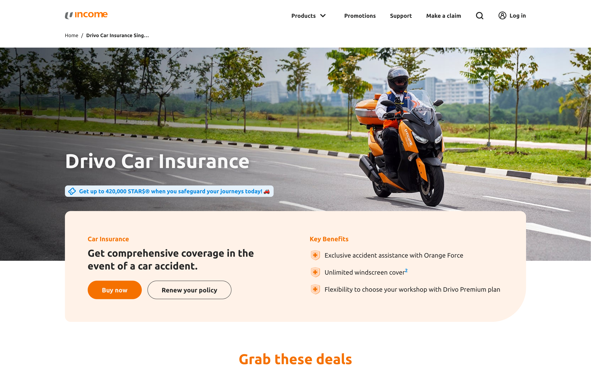
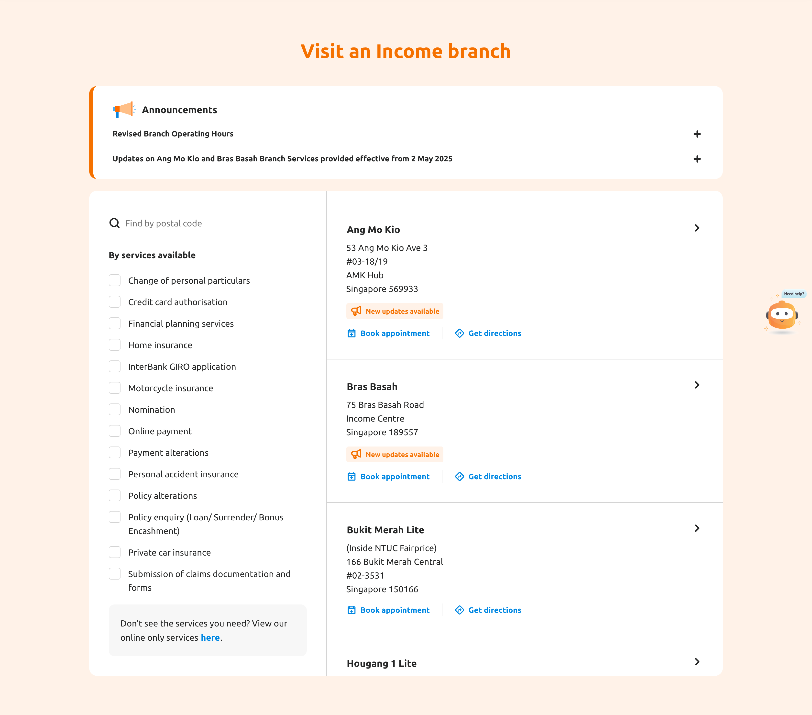
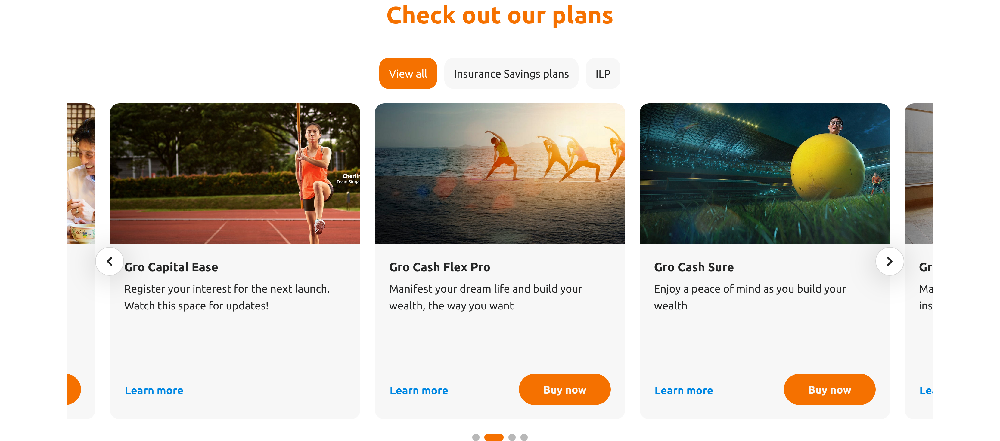
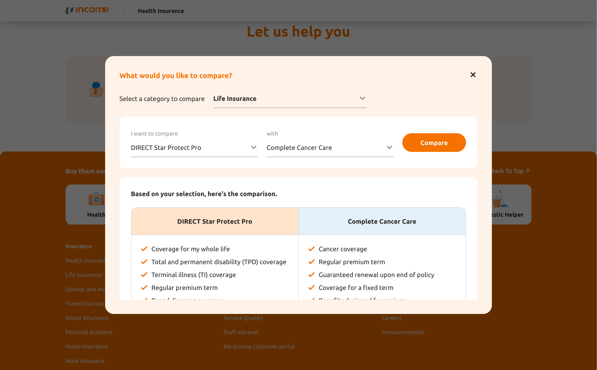
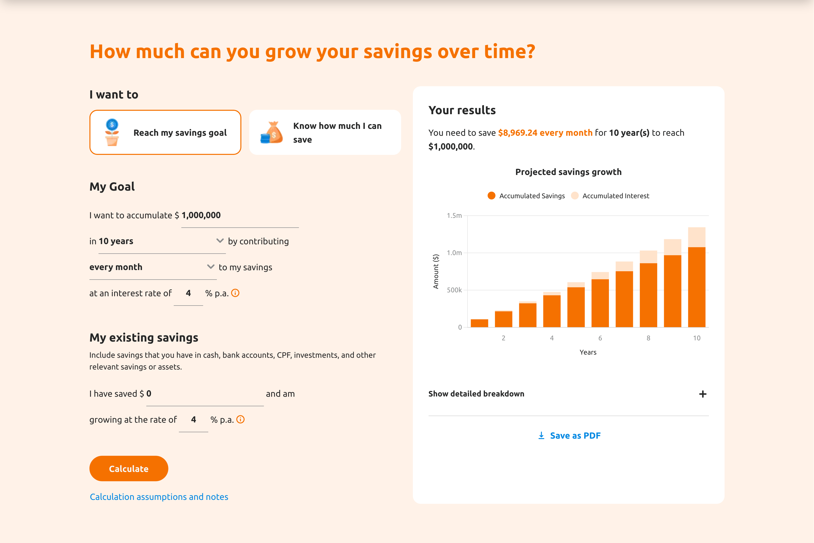

+++
title = "Income Insurance Revamp 2025"
subtitle = "Marketing Website Revamp"
date = "2026-01-15"
description = "I developed the frontend of Income Insurance's marketing website. Income Insurance is one of the largest insurance companies in Singapore."
demo = "https://www.income.com.sg/"
tags = ["react", "storybook", "typescript", "css", "html", "web-development", "api-design", "google-maps-api"]
categories = ["web", "api-design", "google-maps-api", "frontend"]
stack = ["React", "TypeScript", "Storybook", "SASS", "Vite"]
featured = true
+++

> [!WARNING]
> Technical information disclosed in this post are easily found with a bit of analysis of the public facing site. No secrets are exposed.

## Overview
Income Insurance is one of Singapore's largest insurance companies. I had the opportunity to work on revamping their marketing website.

## My Role / Responsibilities
I led the frontend development of the website for 10 months, responsible for about 65% - 75% of all the code written. To be more specific, my responsibilities were:

- **Selected Architecture** - Laid the foundation for how the user interface would be built. Selected **atomic design** as the main methodology, building the components from the most basic building block up to the most complex widgets.
- **Owned Features End-to-End** - Fully owned, implemented, and delivered features from start to finish.
    - Made implementation decisions for many components.
    - Designed APIs and data structure for content delivery.
    - Designed standards on how data flows through components.
- **Contributed to Design** - Contributed and made decisions on web designs when what the client provided wasn't enough.
- **Client Communication** - Discussed with, and gave input to the client on web design decisions.
- Made fundamental decisions for structuring the project
    - Deciding CSS class naming conventions, and CSS code structure.
	- Deciding how responsive styles are implemented.
	- Standardising HTML structures for components.
- Performed code reviews, and testing of code delivered by the team.
- Autonomously worked and delivered on time with minimal or no supervision.

I've consistently delivered on schedule, including voluntary overtime to meet tight deadlines, with fast response times to team communications.

## Tech Stack
The frontend is mostly old school HTML/CSS/JS, with small bits of actual React components for more demanding tasks.

The entire project is built on:
- **Vite** - Handles bundling, and building the CSS/JS files. Minimizes the file sizes, tree-shakes JS code, and bundling them into separate files.
- **Typescript / Javascript / React** - Using React to build the components through JSX, and create functionalities using normal Typescript/Javascript.
- **SASS** - Makes it easier to organize styles.
- **Storybook** - Used to build components in isolation, and for showing components to designers.

## Key Features / Highlights
- **Performance** - Optimised page load times by delivering a small bundle of initial necessary files, and loading additional styles and functionality later.
- **Accessibility** - Met WCAG 2.2 standards across all components.
- **Component-driven architecture** - Built a shared component library used across multiple pages.

## Component Showcase
Here are some components I fully owned, and implemented end-to-end. 

> [!WARNING]
> These are not all of the components I've worked on, just some of the more notable ones to showcase.

### Masthead Banner
This component's complexity isn't through the functionality, but rather how we get HTML/CSS to play nice to implement the unique design.

#### Key Contributions
Figured out how to allow the orange part to be halfway out of the main container while not overlapping the next section, and also let the title/tags to grow upwards when more text/tags are added.

#### Links
Pages with Masthead Banner:
- https://www.income.com.sg/drivo-car-insurance
- https://www.income.com.sg/travel-insurance

### Branch Locator
Branch Locator is a component that lets users locate an Income Insurance branch near their postcode.

#### Key Contributions
- Designed API to load new announcements, available services, and available branches.
- Uses Google Maps Geocode API to transform address into coordinates.
- Implemented filtering mechanism to show available branches using the coordinates and selected services.

#### Links
Page with Branch Locator: https://www.income.com.sg/support

### Custom Carousel Implementation

Initially built as a custom implementation early in the project, but later migrated to a library while making sure it works for components already using it.

#### Key Contributions
- Implemented multiple items per view functionality by grouping them together.
- Improved items detection functionality by adding direction-based detection, and detection by groups of items.
- Improved drag detection logic so that pagination changes as user drags the carousel.

#### Links
Page with custom carousel: https://www.income.com.sg/savings-calculator

### Compare Plans

#### Key Contributions
- Designed API to load category and products.
- Implemented comparison mechanism that loads products to compare, and show the user.

#### Links
Pages with Compare Plans:
- https://www.income.com.sg/health-insurance
- https://www.income.com.sg/life-insurance
- https://www.income.com.sg/savings-and-investments
- ... and more

### Savings Calculator

#### Key Contributions
- Calculated how much users need to save to achieve their goals based on input parameters.
- Calculated how much users can save based on their current financial situation.
- Implemented export to PDF and print so users can save their results.

#### Links
Page with Savings Calculator: https://www.income.com.sg/savings-calculator

## Results
- Successfully launched on schedule on 15th Jan 2026
- Website serves as Income Insurance's primary public-facing marketing platform
- Delivered a reusable component library enabling faster development of new pages
